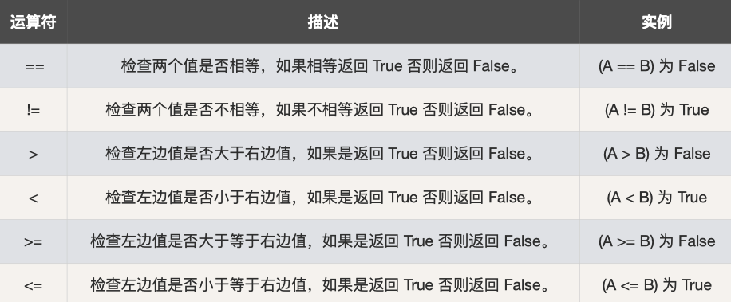
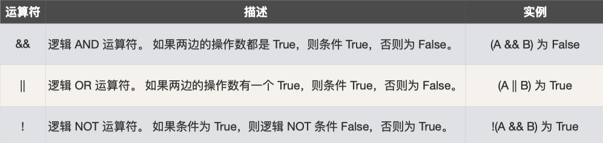
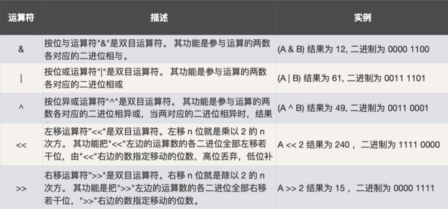
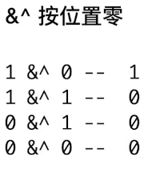
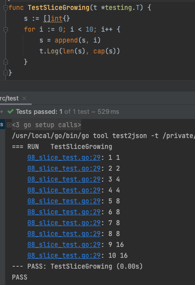

::[https://github.com/geektime-geekbang/go_learning](https://github.com/geektime-geekbang/go_learning)

## ch1 基本数据类型

### 数据类型 02_type_test.go

#### 基本数据类型

bool
string
int    int8    int16    int32    int64
uint    uint8    uint16    uint32    uint64    uintptr
byte    // alias for uint8
rune    // alias for int32, represents a Unicode code point
float32    float64
complex64    complex128

#### 类型转换

go 语言 **不支持隐式**类型转换  
显示类型转换，OK


#### 类型的预定义值

math.MaxInt64
math.MaxFloat64
math.MaxUint32


##### 与其他主要编程语言的差异

1. 不支持指针运算
2. string 是值类型，其默认的初始化值为空字符串，而不是 nil

### 运算符 04_operator_test.go

#### 算术运算符


#### 比较运算符



#### 用 == 比较数组

相同维数且含有相同个数元素的数组才可以比较
每个元素都相同的才相等

#### 逻辑运算符



#### 位运算符



##### 与其他主要编程语言的差异



### 循环 05_loop_test.go

一个 for

### 条件 06_condition_test.go

#### if 条件

##### 与其他主要编程语言的差异

1. condition 表达式结果必须为布尔值
2. 支持变量赋值：

```go
if var declaration; condition {
  // code to be executed if condition is true
}
```

#### switch 条件

##### 与其他主要编程语言的差异

1. 条件表达式不限制为常量或者整数；
2. 单个 case 中，可以出现多个结果选项，使用逗号分隔；(TestSwitchMultiCase)
   3.与C/Java语言等规则相反，Go语言不需要用break来明确退出一个case；
   4.可以不设定switch之后的条件表达式，在此种情况下，整个switch结构与多个 if...else... 的逻辑作用等同（TestSwitchCaseCondition）
   

### 数组 07_array_test.go

#### 数组截取

```go
// a[开始索引(包含), 结束索引(不包含)]
func TestArraySection(t *testing.T) {
	arr := [...]int{0, 1, 2, 3, 4, 5}
	assert.Equal(t, arr[1:2], [...]int{1})
	assert.Equal(t, arr[1:3], [...]int{1, 2})
	assert.Equal(t, arr[1:], [...]int{1, 2, 3, 4, 5})
	assert.Equal(t, arr[:3], [...]int{0, 1, 2})
}
```

### 切片 08_slice_test.go



###  Map 09_map_test.go

```go
func TestAccessNotExistingKey(t *testing.T) {
	if value, isExist := m1[3]; isExist {
		t.Logf("key 3 存在。 value = %d", value)
	} else {
		t.Log("key 3 不存在")
	}
}

func TestTravelMap(t *testing.T) {
	m1 := map[int]int{1: 1, 2: 4, 3: 9}

	for k, v := range m1 {
		t.Log(k, v)
	}

}
```

#### 10_mal_ext_test.go

```go
map[key]func(){}
map[key]bool{}
```

### 字符串 11_string_fun_test.go

#### 与其他主要变成语言的差异

1. string 是数据类型，不是引用或指针类型
2. string 是只读的 byte slice，len 函数可以它所包含的 byte 数
3. string 的 byte 数组可以存放任何数据

1.strings包  [https://golang.org/pkg/strings/](https://golang.org/pkg/strings/)
2.strconv包 [https://golang.org/pkg/strconv/](https://golang.org/pkg/strconv/)

# ch2 函数及面向对象介绍

### Go 语言的函数

#### 与其他主要变成语言的差异（Go语言的函数是一等公民）

1. 可以有多个返回值
2. 所有参数都是**值传递**：slice, map, channel 会有传引用的错觉
3. 函数可以作为变量的值
4. 函数可以作为参数和返回值

---

### Go 语言 是面向对象的语言吗？

yes and no. [https://go.dev/doc/faq#Is_Go_an_object-oriented_language](https://go.dev/doc/faq#Is_Go_an_object-oriented_language)
​

### 封装

```go
type Person struct {
    name string
    age int
}
```

### 接口

_与其他主要变成语言的差异（Go语言的函数是一等公民）：_
1.接口为非入侵性，实现不依赖于借口定义
2.所以接口的定义可以包含在接口使用者包内

### 扩展与复用（继承）

17_extension_test.go
_与其他主要变成语言的差异：_
**不支持**继承、**不支持**重载、**不支持**LSP
它不是继承，如果我们把“内部 struct ”看作⽗类，把“外部 struct” 看作⼦类， 会发现如下问题：

1. 不⽀持⼦类替换
2. ⼦类并不是真正继承了⽗类的⽅法
   • ⽗类的定义的⽅法⽆法访问⼦类的数据和⽅法

### 多态

18_polymorphism_test.go
1个接口，多个实现

### 空接口与断言

19_empty_interface_test.go

1. 空接⼝可以表示任何类型
2. 通过断⾔来将空接⼝转换为制定类型

```go
v, ok := p.(int) //ok=true 时为转换成功
```

# ch3 项目编程规范

### Go 的错误机制

20_err_test.go

#### 与其他主要变成语言的差异

1. 没有异常 try catch 机制
2. error 类型实现了 error 接⼝

```go
type error interface { 
    Error() string 
} 
```

3. 可以通过 errors.New 来快速创建错误实例

```go
errors.New("n must be in the range [0,100]")
```

#### panic vs os.Exit

21_panic_recover_test.go

| panic                               | os.Exit                                 |
| ----------------------------------- | --------------------------------------- |
| panic ⽤于不可以恢复的错误          |                                         |
| panic 退出前会执⾏ defer 指定的内容 | os.Exit 退出时不会调⽤ defer 指定的函数 |
| os.Exit 退出时不输出当前调⽤栈信息  |                                         |

## 包 package


1. 基本复⽤模块单元 以⾸字⺟⼤写来表明可被包外代码访问
2. 代码的 package 可以和所在的⽬录不⼀致
3. 同⼀⽬录⾥的 Go 代码的 package 要保持⼀致

### init 方法

- 在 main 被执⾏前，所有依赖的 package 的 init ⽅法都会被执⾏
- 不同包的 init 函数按照包导⼊的依赖关系决定执⾏顺序
- 每个包可以有多个 init 函数
- 包的每个源⽂件也可以有多个 init 函数，这点⽐较特殊

### 获取远程依赖

1. 通过 go get 来获取远程依赖

   go get -u "github.com/easierway/concurrent_map"


2. 注意代码在 GitHub 上的组织形式，以适应 go get

   直接以代码路径开始，不要有 src

   示例： https://github.com/easierway/concurrent_map

---

常用 module

> go get -u github.com/easierway/concurrent_map
>
> go get -u github.com/stretchr/testify/assert
>
> go get -u github.com/smartystreets/goconvey/convey
>
> go get -u github.com/mailru/easyjson/...
>
> go get -u github.com/julienschmidt/httprouter
