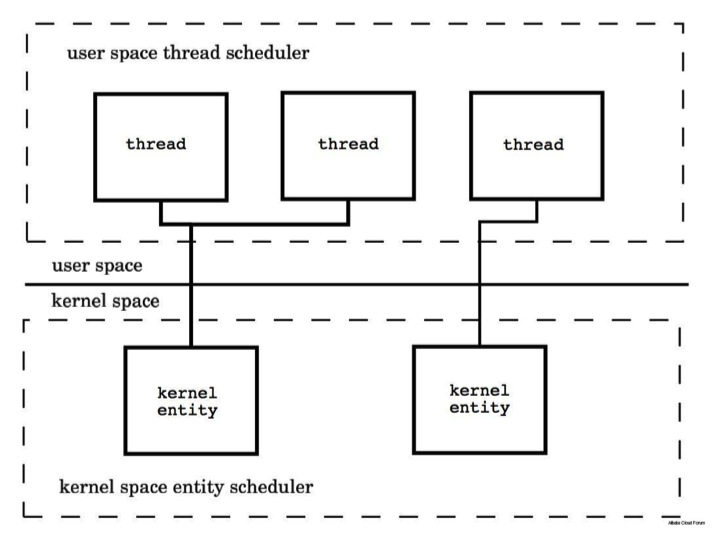
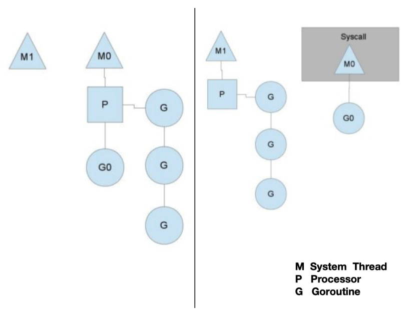

# ch4 并发编程

## Thead vs. Groutine

1. 创建时默认的 stack 的⼤⼩
   - JDK5 以后 Java Thread stack 默认为1M
   - Groutine 的 Stack 初始化⼤⼩为2K


2. 和 KSE （Kernel Space Entity) 的对应关系
   - Java Thread 是 1:1
   - Groutine 是 M:N





计数器：procesor 完成的 协程的数量。。长时间不变，直接中断

## 协程

```go
func TestGroutine(t *testing.T) {
	for i := 0; i < 10; i++ {
		go func(i int) {
			fmt.Println(i)
		}(i)
	}
	time.Sleep(time.Millisecond * 50)
}
```

## CSP(Communicating sequential processes) 并发机制

类似于 Java 中的 Future

[26_async_service_test.go](../src/test/chapter/ch4/26_async_service_test.go)

## 多路选择 和 超时控制

[27_select_test.go](../src/test/chapter/ch4/27_select_test.go)

## Channel 的关闭和广播

[28_select_close_test](../src/test/chapter/ch4/28_select_close_test.go)

- 向关闭的 channel 发送数据，会导致 panic
- v, ok <-ch; ok 为 bool 值，true 表示正常接受，false 表示通道关闭
- 所有的 channel 接收者都会在 channel 关闭时，⽴刻从阻塞等待中返回且上 述 ok 值为 false。这个⼴播机制常被利⽤，进⾏向多个订阅者同时发送信号。 如：退出信号。

## Context 与 任务取消

[29_cancel_test](../src/test/chapter/ch4/29_cancel_test.go)

[30_cancel_by_context_test.go](../src/test/chapter/ch4/30_cancel_by_context_test.go)

Context

- 根 Context：通过 context.Background () 创建
- ⼦ Context：context.WithCancel(parentContext) 创建
  - ctx, cancel := context.WithCancel(context.Background())
- 当前 Context 被取消时，基于他的⼦ context 都会被取消
- 接收取消通知 <- ctx.Done()

## 常见并发任务

### 仅执行一次

单例模式（懒汉式、线程安全）

[31_once_test.go](../src/test/chapter/ch4/31_once_test.go)

```go
var singleInstance *Singleton
var once sync.Once

func GetSingletonObj() *Singleton {
	once.Do(func() {
		fmt.Println("create obj")
		singleInstance = new(Singleton)
	})
	return singleInstance
}
```

### 仅需任意任务完成

[32_first_response_test](src/test/chapter/ch4/32_first_response_test)

### 必须所有任务完成

[33_util_all_done_test](src/test/chapter/ch4/33_util_all_done_test)

## 对象池

### 使⽤buffered channel实现对象池

[34_obj_pool_test.go](src/test/chapter/ch4/34_obj_pool_test.go)

### sync.Pool

- 适合于通过复⽤，降低复杂对象的创建和 GC 代价
- 协程安全，会有锁的开销
- ⽣命周期受 GC 影响，不适合于做连接池等，需⾃⼰管理⽣命周期的资源的池化